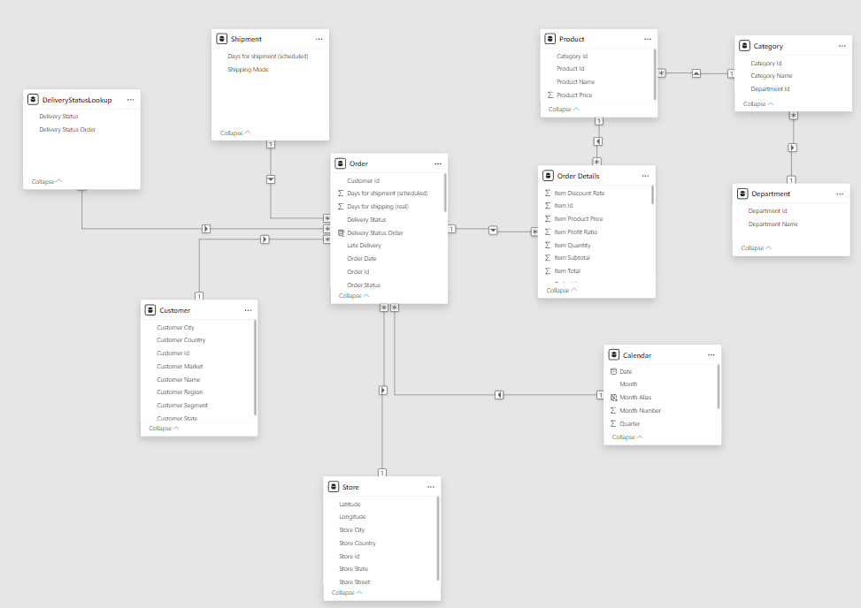
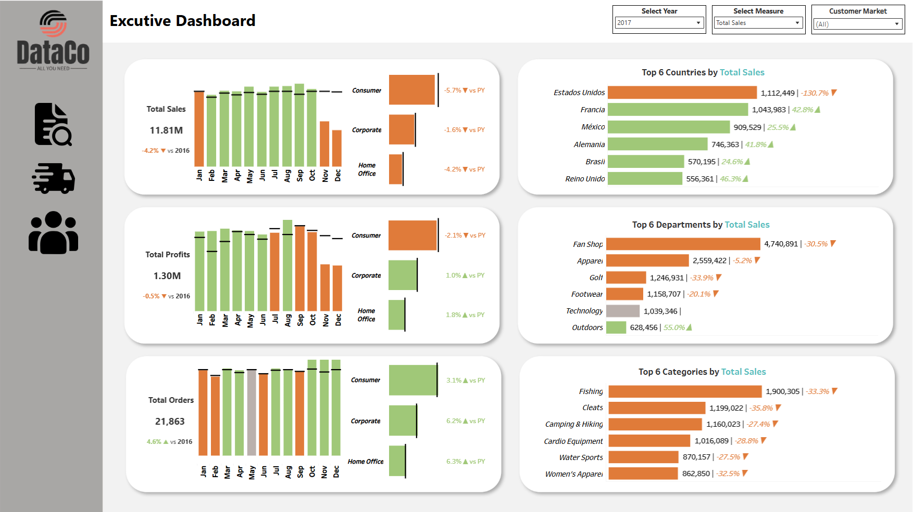
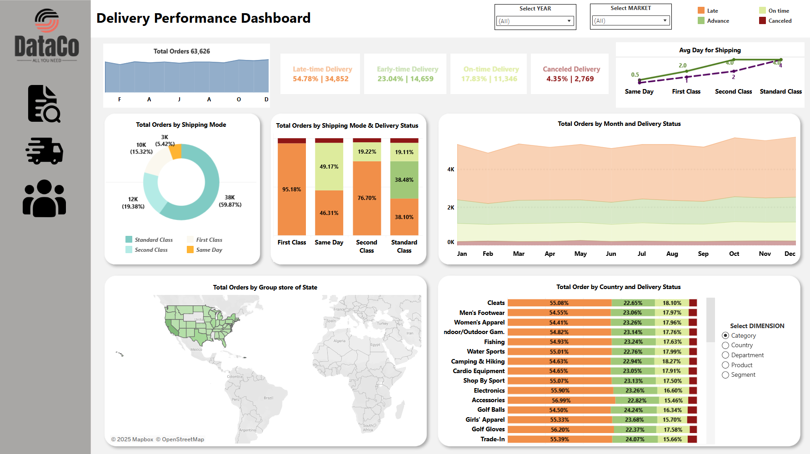
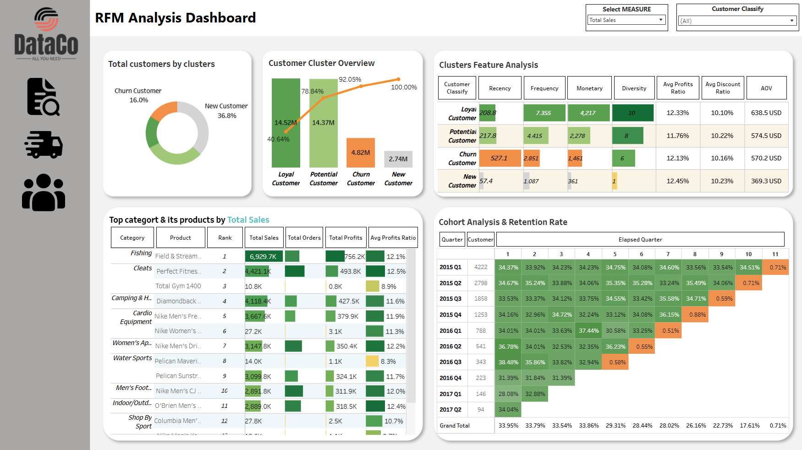

# 🏬 Retail Smart Supply Chain Analysis & BI Dashboards

**Tagline:** A complete end-to-end analytics initiative integrating Power BI, Python, and Tableau to assess business performance, resolve delivery inefficiencies, and segment customers for a major global retail chain.

---

## 📌 Project Overview

This initiative provides a thorough analysis of a large-scale, multi-national retail dataset. The workflow combines extensive data preprocessing, machine learning, and interactive dashboards to surface strategic insights that drive decisions on business expansion, logistics optimization, and customer engagement.

---

## 📊 Tools & Tech Stack

* 💻 **Power BI**: Data cleansing, modeling, and primary dashboards
* 🐍 **Python (Pandas, Scikit-learn)**: RFM metrics & customer segmentation via KMeans
* 🔢 **Tableau**: Executive and delivery-focused dashboards for visual storytelling

---

## 📀 Dataset
**Source:** [Kaggle - DataCo Smart Supply Chain](https://www.kaggle.com/datasets/shashwatwork/dataco-smart-supply-chain-for-big-data-analysis)
* \~180,000 rows × 52 fields
* Transaction-level data covering: orders, customers, shipping, financials, products
* Allows multi-faceted analysis of:

  * Financial performance: revenue, costs, net profit
  * Delivery timeliness & mode efficiency
  * Customer behavior, loyalty, and value

  
 
<em>DataCo Relational Data Model (RDM)</em>

---

## 📊 Dashboard Snapshots

* 1️⃣ Executive Summary Dashboard
* 2️⃣ Delivery Insights Dashboard
* 3️⃣ Customer Segmentation & RFM Analysis Dashboard

  
  <em>Executive Performance Overview</em>

  
  <em>Delivery Delays & Fulfillment KPIs</em>

  
  <em>Customer Segmentation using RFM + KMeans</em>

---

## 🚀 Dashboard Access

* 📊 **Tableau Public**: [Link to Interactive Dashboard](https://public.tableau.com/app/profile/truonghuyphan.da/viz/TABLEAU-DataCoDashboard/EXCUTIVEdashboard)
* 📊 **Power BI**: Available via `.pbix` file in project folder

---

## 🚀 Project Objectives

Build 3 core dashboards to extract insights across strategic pillars:

### 📈 Executive Dashboard

* Track global KPIs: revenue, profit, cost trends
* Identify top-performing product lines and regions

### 🚚 Delivery Performance Dashboard

* Evaluate shipping classes and regions with delay issues
* Quantify timeliness, fulfillment rate, and bottlenecks

### 📅 RFM + Segmentation Dashboard

* Apply RFM scoring methodology
* Use KMeans to cluster customers into behavioral segments:

  * Loyal, Potential, New, Churned

---

## 📆 Project Workflow

### 🔧 Data Preprocessing & Modeling (Power BI)

* Removed duplicates and handled null values
* Ensured consistent data types
* Built data relationships to optimize DAX measures

### 📊 Customer Segmentation (Python)

* Computed Recency, Frequency, Monetary metrics
* Used KMeans to segment customers by purchase behavior

### 📊 Dashboard Development (Power BI & Tableau)

* Power BI: Used for comprehensive KPIs, delivery visuals, and segmentation
* Tableau: Created interactive exploratory views for exec and delivery teams

---

## 🔍 Key Findings

### 🏦 Business Performance

* High cost base: Discounts \~11%, other operational costs \~81% → Net profit margin only \~8.3% — low for retail
* Global operations: 15K stores, but Puerto Rico leads in revenue (>38.5%) despite USA holding 54.1% of store count
* Regional breakdown: Asia-Pacific (33.2%) and Europe (31.9%) are key markets
* Anomaly in 2017: Revenue drop in Q4 despite +4.6% order growth → lower average order value

### 🚗 Delivery Efficiency

* Completion rate is high (95.65%) but delivery punctuality is poor: 54.8% late
* First Class shipping doubles the delay risk; Second Class increases risk by 1.55x
* Even Same Day shipments show frequent delays
* Systematic lateness observed across time and regions

### 🛋 Customer Insights

* Retention issue: Only \~33% of customers return after the first quarter
* Loyal + Potential segments (\~47% of base) contribute \~80% of revenue
* New customers make up 37% of base, but contribute <10% in value
* Churned users had high AOV before exit → show signs of missed opportunities

### 💸 Discount Effectiveness

* Loyal customers get fewer discounts but are highly profitable → should prioritize experience
* Churned customers left despite large discounts → indicates dissatisfaction not price-driven
* Discount-heavy strategy misfires on Potential group

---

## 🔎 Recommendations

### 🚚 Improve Logistics Reliability

* Investigate root causes of First & Second Class delays
* Rethink shipping strategy or revise ETA promises
* Strengthen warehouse planning and regional coordination

### 🌍 Prioritize High-Risk Zones

* Focus on East/North Africa, and Health & Beauty category (delay hotspots)

### 🎈 Refine Promotions Strategy

* Tailor discounts to match customer behavior clusters
* Increase non-price incentives for Loyal and Churned segments

---
